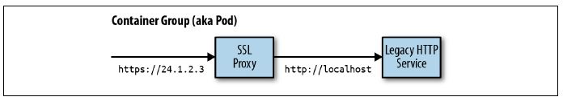
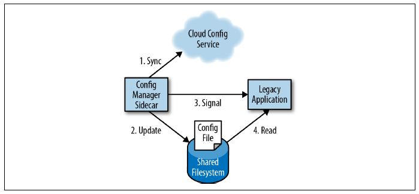
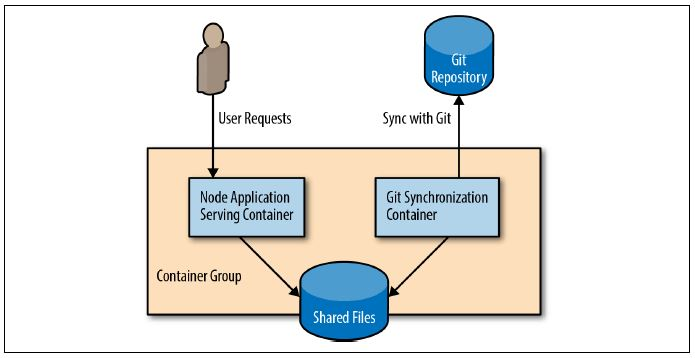

# Single Node Patterns

Why you might also want to break up the components running on
a single machine into different containers?

```
    * The goal of a container is to establish boundaries around specific resources
(e.g., this application needs two cores and 8 GB of memory).

    * The boundary
delineates team ownership (e.g., this team owns this image).

    * The boundary is
intended to provide separation of concerns (e.g., this image does this one thing) ensures that your application is well understood
and can easily be tested, updated, and deployed. Small, focused applications are
easier to understand and have fewer couplings to other systems.

All of these reasons provide motivation for splitting up an application on a single
machine into a group of containers.
```

- All of Single Node patterns
  assume tight dependencies among all of the containers.
- All of the containers in the pattern can be reliably coscheduled onto a single machine.
- They also assume that all of the containers in the pattern can
  optionally share volumes or parts of their filesystems as well as other key container
  resources like network namespaces and shared memory. This tight grouping is called
  a pod in Kubernetes.

## The Sidecar Pattern

The sidecar pattern is a singlenode
pattern made up of two containers. The first is the **application container**. It contains
the core logic for the application. Without this container, the application would
not exist. In addition to the application container, there is a **sidecar container**.

The role
of the sidecar is to augment and improve the application container, often **without the
application container’s knowledge**.

In its simplest form, a sidecar container can be
used to add functionality to a container that might otherwise be difficult to improve.
Sidecar containers are **coscheduled** onto the same machine via an atomic container
group, such as the pod API object in Kubernetes.

In addition to being scheduled on
the same machine, the application container and sidecar container **share a number of
resources, including parts of the filesystem, hostname and network, and many other
namespaces**.

### Adding HTTPS to a Legacy Service



### Dynamic Configuration with Sidecars



### Modular Application Containers

- Main advantages of using the sidecar pattern is modularity and reuse of the
  components used as sidecars.
- topz functionality can be deployed as a sidecar container that shares the process-id
  (PID) namespace with the application container. This topz container can introspect
  all running processes.
- Moreover, you can use
  the orchestration system to automatically add this container to all applications
  deployed via the orchestration system to ensure that there is a consistent set of tools
  available for all applications running in your infrastructure.

  ##### Hands On:

  ```
    $ docker run -d <my-app-image>
    $ <container-hash-value>

    Store the container-hash-value in an environment variable named APP_ID


    $ docker run --pid=container:${APP_ID} \
        -p 8080:8080 \
        brendanburns/topz:db0fa58 \
        /server --addr=0.0.0.0:8080
  ```

### Building a Simple PaaS with Sidecars

- The sidecar pattern can be used for more than adaptation and monitoring. It can also
  be used as a means to implement the complete logic for your application in a simplified,
  modular manner.

  

### Designing Sidecars for Modularity and Reusability

- Parameterizing your containers
  - There are two
    ways in which parameters can be passed to your container: through environment
    variables or the command line.
  - General preference
    for passing parameters via environment variables.
- Creating the API surface of your container
  - Need to be very
    conscious of the API that your sidecar provides, and that “breaking” changes to that
    API may not always be as obvious as changing the name of a parameter.
- Documenting the operation of your container

  ```
  # Main web server runs on port 8080
  EXPOSE 8080

  # The PROXY_PORT parameter indicates the port on localhost to redirect traffic to.
  ENV PROXY_PORT 8000

  LABEL "org.label-schema.vendor"="name@company.com"
  LABEL "org.label.url"="http://images.company.com/my-cool-image"
  LABEL "org.label-schema.version"="1.0.3"
  ```
