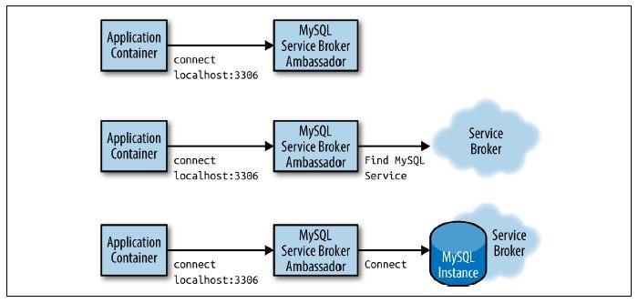

# Ambassadors

Ambassador container brokers interactions between the application
container and the rest of the world.

Application and Ambassador containers are tightly linked in a symbiotic pairing that is scheduled to a single machine.

## Generic Ambassador Pattern

### Benefits:

- Modular, reusable containers.
- Separation of concerns makes the containers easier to build and maintain.
- Ambassador container can be reused with a number of different application containers.

### Examples of Ambassador Patterns

- Using an Ambassador to Shard a Service
- Using an Ambassador for Service Brokering
- Using an Ambassador to Do Experimentation or Request
  Splitting

## Using an Ambassador to Shard a Service

- Sharding splits up the storage layer into multiple disjoint pieces, each hosted by a separate machine.

  

- When deploying a sharded service, one question that arises is how to integrate it with the frontend or middleware code that stores data. Clearly there needs to be logic that routes a particular request to a particular shard.

- The different approaches are described below:

  #### Approach 1 : Sharded client

  - Implement a a sharded client into existing source code.
  - Its difficult to retrofit because the existing code expects to connect to a single storage backend.
  - Sharded services make it difficult to share configuration
    between development environments (where there is often only a single storage shard) and production environments (where there are often many storage shards).

  #### Approach 2 : Sharding logic into the Sharded service

  - Build all of the sharding logic into the sharded service itself
  - The sharded service also has a stateless load balancer that directs traffic
    to the appropriate shard.
  - Effectively, this load balancer is a distributed ambassador as
    a service. This makes a client-side ambassador unnecessary at the expense of a more complicated deployment for the sharded service

  #### Approach 3 : Single-node ambassador on the client side

  - Integrate a single-node ambassador on the client side to route traffic to the appropriate shard.
  - This makes deploying the client somewhat more complicated but simplifies the deployment of the sharded service.
  - When adapting an existing application to a sharded backend, you can introduce an ambassador container that contains all of the logic needed to route requests to the appropriate storage shard. Thus, your frontend or middleware application only connects to what appears to be a single storage backend running on localhost. However, this server is in fact actually a `sharding ambassador proxy`, which receives all of the requests from your application code, sends a request to the appropriate storage shard, and then returns the result to your application.
  - The net result of applying the ambassador pattern to sharded services is a separation of concerns between the application container, which simply knows it needs to talk to a storage service and discovers that service on localhost, and the sharding ambassador proxy, which only contains the code necessary to perform appropriate sharding.
  - As with all good single-node patterns, this ambassador can be reused between many different applications.

  - `twemproxy` is a lightweight, highly performant proxy for memcached and Redis, which was originally developed by Twitter and is open source and available on [GitHub](https://github.com/twitter/twemproxy).

## Using an Ambassador for Service Brokering

- When trying to render an application portable across multiple environments (e.g.,public cloud, physical datacenter, or private cloud), one of the primary challenges is service discovery and configuration.
- To understand what this means, imagine a frontend that relies on a MySQL database to store its data. In the public cloud, this MySQL service might be provided as software-as-a-service (SaaS), whereas in a private cloud it might be necessary to dynamically spin up a new virtual machine or container running MySQL.
- Consequently, building a portable application requires that the application know how to introspect its environment and find the appropriate MySQL service to connect to. This process is called `service discovery`, and the system that performs this discovery and linking is commonly called a `service broker`.
- The application simply always connects to an instance of the service (e.g., MySQL) running on localhost. It is the responsibility of the service broker ambassador to introspect its environment and broker the appropriate connection.

## Using an Ambassador to Do Experimentation or Request Splitting

- Perform experimentation or other forms of request splitting.
- It is advantageous to be able to perform request splitting, where some fraction of all requests are not serviced by the main production service but rather are redirected to a different implementation of the service. Most often, this is used to perform experiments with new, beta versions of the service to determine if the new version of the software is reliable or comparable in performance to the currently deployed version.
- Request splitting is sometimes used to tee or split traffic such that all traffic goes to both the production system as well as a newer, undeployed version. The responses from the production system are returned to the user, while the responses from the tee-d service are ignored. Most often, this form of request splitting is used to simulate production load on the new version of the service without risking impact to existing production users.
